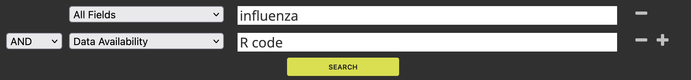

# Portfolio (toetsing)

```{r echo=FALSE}
deadline_summatief <- "zondag 25 mei 2025 23.59 uur"
deadline_formatief <- "donderdag 25 april 2025 23.59 uur"
assessments <- "dinsdag 3 juni 2025"
sql_assessment_1 <- "woensdag 7 mei 2025"
sql_assessment_2 <- "vrijdag 16 mei 2025"
```


## Algemene informatie over het portfolio {-} 

Tijdens de cursus Workflows werk je aan een **portfolio** en dit portfolio wordt uiteindelijk beoordeeld voor een cijfer. Het portfolio is een product dat je later kunt gebruiken als je ergens wilt solliciteren (bijv. voor een stage of een baan). Het portfolio kun je na deze cursus dan ook uit blijven breiden. Het doel van het portfolio is om te laten zien welke skills jij beheerst op het gebied van Data Science for Biology. 

### Inhoud van het portfolio {-} 

In het portfolio verwerk je de onderdelen die hieronder genoemd worden (in de sectie ['Onderdelen van het portfolio'](#onderdelen-van-het-portfolio-opdrachten)). Het is belangrijk dat je alle portfolio opdrachten verwerkt in je portfolio. We willen de opdrachten niet terugzien als opdrachten (dus geen portfolio met headers als 'Opdracht 1', 'Opdracht 2' etc.). In plaats daarvan kun je de opdrachten beter inhoudelijke titels geven en moet je uitleggen wat er te zien is. Houd in je achterhoofd dat het portfolio bedoeld is voor toekomstige werkgevers. 

Verder is het de bedoeling dat je laat zien wat je kunt. Maak dus gebruik van de mogelijkheden van Rmarkdown en (eventueel) css. 

### Deadline en inlevervoorwaarden {-} 

Het portfolio moet uiteindelijk ingeleverd worden **vóór `r deadline_summatief`**. Je portfolio wordt beoordeeld als het voldoet aan de inlevervoorwaarden. De inlevervoorwaarden zijn als volgt:

- Het portfolio is gehost via GitHub pages (zie ook de sectie ['Hosten van het portfolio'](#hosten-van-portfolio-github-pages)). 
- Het portfolio is gemaakt met [bookdown](https://bookdown.org/) en de bookdownbestanden (o.a. Rmarkdown bestanden) staan in een GitHub repository. 
- Er is een R package gemaakt en dit R package is beschikbaar gemaakt via een GitHub repository (zie opdracht 6 van de portfolio-opdrachten).
- De GitHub repositories zijn toegankelijk voor de docenten (public repository of een private repository waarin de docenten leesrechten hebben).
- Er is een e-mail verstuurd vóór de deadline naar de docenten met daarin de links naar het gehoste portfolio, de GitHub repository met de bookdown bestanden en de GitHub repository voor het R package. 

### Feedback op het portfolio {-} 

Tijdens de meeste lessen van de cursus is er tijd om aan het portfolio te werken. Het is dan ook mogelijk om aan de docenten feedback te vragen. Zorg er dus voor dat je zelf bij de docenten aangeeft wanneer je graag feedback wilt en waarop. 

Tijdens de cursus is er ook een formatief inlevermoment. Hiervoor is het de bedoeling dat je de tussentijdse versie portfolio **vóór `r deadline_formatief`** deelt met de docenten. De docenten kunnen dan in de lessen hierna feedback geven op je portfolio. 

### Plagiaat en het gebruik van Generatieve AI {-} 

Zoals altijd is plagiaat (het gebruik/kopiëren van werk van anderen zonder bronvermelding) niet toegestaan. Het is ook niet toegestaan om je portfolio door anderen te laten maken. Je bent zelf verantwoordelijk voor de inhoud van je portfolio. Alle verdenkingen van plagiaat of andere vormen van fraude worden gemeld bij de Examencommissie van het ILC. 

Natuurlijk is het wel toegestaan om informatie op het internet te gebruiken. Ook is het toegestaan om Generatieve AI tools (zoals ChatGPT of Co-pilot) te gebruiken. Voorwaarde voor het gebruik van deze hulpmiddelen is dat je aangeeft in het portfolio waar en waarvoor je gebruik hebt gemaakt van deze bronnen.

### Assessment {-} 

De cursus wordt afgesloten met een assessment. De assessments worden gehouden op **`r assessments`**. Hierin krijg je kort de tijd (15 minuten) om je portfolio toe te lichten en om vragen van de docenten te beantwoorden. Het assessment is vooral bedoeld om te toetsen of je jouw portfolio zelf hebt gemaakt (en om dus fraude uit te sluiten). 


## Het opzetten van je portfolio (GitHub, Bookdown en GitHub pages) {-} 

Hieronder vind je de stappen die nodig zijn om je portfolio op te zetten. Zorg ervoor dat je deze stappen hebt gevolgd voordat je 

### Stap 1. Maak een GitHub repository voor je portfolio {-} 

Het is de bedoeling dat je alle portfolio documenten (Rmarkdown bestanden en andere bestanden) beheert met git en GitHub. In hoofdstuk 1 van de reader wordt uitgelegd hoe je een GitHub repository kunt opzetten en kunt clonen naar je computer. Volg deze stappen om een GitHub repository te maken voor je portfolio. 

<div class="tip">

Je kunt ervoor kiezen om de GitHub repository voor je portfolio **public** te maken. In dat geval kan iedereen de inhoud ervan zien. Je kunt er ook voor kiezen om de repository **private** te maken. In dat geval moet je ervoor zorgen dat de docenten toegang hebben tot de repository!

</div>

Als je een clone hebt gemaakt op je computer, kun je bestanden toevoegen aan de map van de directory en deze met git commiten en pushen. Het is de bedoeling dat je dit regelmatig doet, zodat de wijzigingen in de bestanden bijgehouden worden met git en te zien zijn in je GitHub repository. 

### Stap 2. Maak een portfolio met bookdown {-} 

We gebruiken het `bookdown` package om een portfolio website te maken. Hierbij worden meerdere Rmarkdown bestanden gebruikt als input en omgezet naar een mooie website. De Rmarkdown bestanden voor de portfolio website slaan we op in de map van de portfolio repository die we bij stap 1 hebben gemaakt.

Om je portfolio met `bookdown` te kunnen maken, moet je ervoor zorgen dat je een **index.Rmd** Rmarkdown aanmaakt en dat je voor elke pagina in het portfolio een aparte Rmarkdown bestand aanmaakt. De volgorde van de pagina's op je website wordt bepaald door de alfabetische volgorde van de Rmarkdown bestandnamen (de index is altijd de startpagina, en de pagina's daarna zijn op basis van alfabetische volgorde). 

Een simpel voorbeeld voor de `bookdown` structuur is te vinden op [deze website](https://bookdown.org/yihui/bookdown/get-started.html). Je kunt dit voorbeeld gebruiken om je eigen portfolio te maken.  

Om de Rmarkdown bestanden in je portfolio repository om te zetten naar een website, voeren we de volgende code uit in de R console:

`bookdown::render('.')`

### Stap 3. Host je portfolio met GitHub pages {-}

Met GitHub is het mogelijk om een website te hosten met GitHub pages. Je gaat dit gebruiken om de website voor je portfolio beschikbaar te maken voor anderen. Volg hiervoor de volgende stappen:

1. Maak een GitHub repository aan met de naam gebruikersnaam.github.io, waar 'gebruikersnaam' vervangen moet zijn door jouw GitHub gebruikersnaam. Zorg er ook voor dat de repository public is (en niet private). Zie hieronder voor een voorbeeld:

{width=60%}

**NB: als je je portfolio host met GitHub pages is het voor iedereen zichtbaar. Zorg er dus voor dat je geen persoonsgegevens deelt in je portfolio die je niet met anderen wilt delen! Zorg er ook voor dat er geen data wordt gedeeld die niet gedeeld mag worden (bijvoorbeeld data van het projecticum)!**

2. Clone deze nieuwe GitHub repository naar je computer. 

3. Kopieer alle bestanden in de bookdown folder van je portfolio repository (dus alle bestanden in het mapje **\_book**) naar de map van de nieuwe GitHub pages repository.

4. Push de bestanden naar GitHub.

5. Bekijk of de website zichtbaar is door op het web te gaan naar https://gebruikersnaam.github.io (waarbij je opnieuw 'gebruikersnaam' vervangt door jouw GitHub gebruikersnaam). 

<div class="tip">

Soms worden figuren niet weergegeven in het gehoste portfolio. Je kunt dit vaak oplossen door een leeg tekstbestand toe te voegen aan de GitHub pages repository en dit bestand op te slaan als **.nojekyll** (dus geen naam en dan de file extensie `nojekyll`). 

</div>

Mocht je meer willen leren over GitHub pages, dan kun je [deze handleiding](https://docs.github.com/en/pages/getting-started-with-github-pages) gebruiken.

## Onderdelen van het portfolio (opdrachten) {-} 

### 1. CV en toekomstplan {-} 

#### 1a. Curriculum Vitae {-} 

<div class="dagopdracht">

Maak met Rmarkdown een Curriculum Vitae (CV). Maak het CV op een professionele manier, zodat je het kunt gebruiken voor het solliciteren naar een stageplek of een baan. Zorg ervoor dat je je skills benoemt en natuurlijk ook je Data Science for Biology skills. 

**NB: je portfolio is online beschikbaar. Zorg er dus voor dat alleen gegevens zichtbaar zijn die je wilt delen. Laat persoonsgegevens en/of foto's achterwege als je die niet wilt delen!**

Voor het maken van CVs met Rmarkdown zijn verschillende voorbeelden/templates beschikbaar op het internet. Maak hier vooral gebruik van, maar zorg er wel voor dat je naar de gebruikte templates verwijst (dus dat je credits geeft aan de juiste personen).

</div>

#### 1b. Plan voor de toekomst {-} 

<div class="dagopdracht">

In de cursus Workflows is ruimte gereserveerd voor het leren van een nieuwe Data Science for Biology skill (zie de opdracht hierna). Om een skill te kunnen kiezen die relevant is voor jouw toekomst, is het van belang dat je een beeld vormt van jouw toekomst. 

Werk hiervoor de volgende vragen uit in je portfolio:

1. Waar zou je graag willen werken over 1 of 2 jaar? Hoe zie jouw droombaan er uit?

2. Hoe sta je er nu voor om daadwerkelijk aan die droombaan te kunnen beginnen? Welke skills heb je al?

3. Welke skills zou je nog moeten/willen leren?

Mocht je moeite hebben met het beantwoorden van deze vragen, dan kun je op het internet op zoek gaan naar interessante vacatures. Je kunt dan in de vacatures kijken wat er gevraagd wordt, om zo voor jezelf te identificeren wat je al kunt en wat nog niet.

</div>

### 2. Vrije opdracht {-} 

<div class="dagopdracht">

In zelfstudietijd voor de Workflows cursus is 32 uur gereserveerd voor het uitwerken van de vrije opdracht. Het idee is dat je in deze tijd een start maakt met het leren van een nieuwe zelf gekozen Data Science for Biology skill. **Het is belangrijk dat je op tijd begint met de vrije opdracht en dat je hier zelf tijd voor inplant buiten de lessen!**. 

De vrije opdracht bestaat uit drie onderdelen (en al deze onderdelen moeten binnen 32 uur worden uitgevoerd, er is niet meer tijd voor gereserveerd):

1. Het kiezen van een nieuwe Data Science for Biology skill die je wilt leren. Deze skill is afhankelijk van je toekomstplan (bijvoorbeeld wat je gaat/wilt doen in je stage of in je droombaan) en moet ook vanuit dit toekomstplan onderbouwd worden. De onderbouwing voor je keuze is onderdeel van de beoordeling.

2. Het maken van een planning. Hoe ga je de nieuwe skill leren? Wat is daarvoor nodig? En hoe ga je aan ons laten zien dat je de skill geleerd hebt? Hoeveel tijd ga je voor de verschillende stappen (leren, toepassen en uitwerken) reserveren en wanneer ga je planning uitvoeren? Ook deze planning wordt beoordeeld.

3. De uitwerking van je vrije opdracht. Dit moet iets zijn wat je **zelf hebt gemaakt** (vaak een stuk zelfgeschreven code) waarin je laat zien dat je de nieuwe skill beheerst. Om de nieuwe skill te leren mag je natuurlijk een tutorial volgen, maar de uitwerking daarvan is niet voldoende; je zult het geleerde toe moeten passen op iets nieuws, bijvoorbeeld een andere dataset. 

Voorbeelden van vrije opdrachten:

- Het leren analyseren van massa spectrometriedata in R.
- Het leren analyseren van single-cell RNA-seq data. 
- Het leren toepassen van machine learning technieken om te voorspellen of een persoon kanker heeft of niet.
- Het leren identificeren van resistentiegenen in bacteriegenomen. 

Naast deze voorbeelden zijn er nog veel meer mogelijkheden. Je bent vrij om te kiezen wat je wilt, zolang het maar een skill is binnen de Data Science for Biology. Let wel op dat het onderwerp niet mag overlappen met je Projecticum onderwerp, omdat je dan geen extra tijd investeert in het leren van de skill (die tijd is dan immers al nodig voor het Projecticum).

Mocht je twijfelen of graag overleggen, geef dit dan aan bij de docent in de eerste week van de cursus.

</div>

### 3. Data management {-} 

#### 3a. Formatieve opdracht RNA-seq DAUR2 {-}

<div class="dagopdracht">

Pas de Guerilla Analytics regels voor data management toe op de RNA-sequencing formatieve opdracht van de DAUR2 module uit de DSFB1 cursus. Je hoeft hiervoor niet alle bestanden van de server te downloaden! In plaats daarvan kun je een map aanmaken op je laptop en binnen die map lege bestanden aanmaken met dezelfde naam als de bestanden op de server. 

Zorg ervoor dat alle databestanden (fastq, bam, count bestanden etc.) op de juiste plaats worden weggezet. Maak ook een README bestand voor de inhoud van de nieuw ingerichte map.

Neem in je portfolio het volgende op:

- Een screenshot van de mapstructuur en de bestanden in de (sub)map(pen). Gebruik hiervoor de `dir_tree` functie uit het `fs` package om een screenshot te kunnen maken.
- Een screenshot van de inhoud van het README bestand.

</div>

#### 3b. Portfolio repository {-}

<div class="dagopdracht">

Pas de Guerilla Analytics regels voor data management toe op jouw portfolio repository. 

Neem in je portfolio het volgende op:

- Een screenshot van de mapstructuur en de bestanden in de (sub)map(pen). Gebruik hiervoor de `dir_tree` functie uit het `fs` package om een screenshot te kunnen maken.
- Een screenshot van de inhoud van het README bestand.

</div>

### 4. Reproducible Science {-}

#### 4a. Een data analyse van een ander reproduceren {-}

<div class="dagopdracht">

In deze opdracht gaan we de data van een collega-laborant analyseren. Het doel is om de analyse reproduceerbaar uit te werken in een Rmarkdown bestand. 

De data is afkomstig van het HU lectoraat Innovative Testing in Life Sciences & Chemistry. De data is verkregen door *C. elegans* bloot te stellen aan verschillende doses van verschillende chemicaliën. De volgende variabelen in de dataset zijn van belang voor de analyse:

- `RawData`: het aantal nakomelingen dat is geteld. 
- `compName`: de naam van het chemicalie waaraan de wormen zijn blootgesteld. 
- `compConcentration`: de gebruikte concentratie van het chemicalie.
- `expType`: een variabele die aangeeft of de meting een experimentele conditie is, of een controle conditie (negatieve controle of vehicle controle).

Je kunt de data [hier downloaden](https://github.com/DataScienceILC/tlsc-dsfb26v-20_workflows/raw/main/data/CE.LIQ.FLOW.062_Tidydata.xlsx). 

Voer de onderstaande stappen uit in je analyse:

- Lees de data in in R met het `readxl` package. 
- Inspecteer de data. Is de data goed ingelezen? Kloppen de data types voor `rawData`, `compName` en `compConcentration`?
- Maak een scatter plot voor de verschillende chemicaliën en concentraties: 

    - Geef de `compConcentration` weer op de x-as. Zorg ervoor dat de labels op de x-as leesbaar zijn!
    - Geef de `RawData` weer op de y-as. 
    - Visualiseer de verschillende chemicaliën met verschillende kleuren. 
    - Gebruik verschillende symbolen (`shape = `) voor de `expType` variabele. 
    - Controleer of de volgorde op de x-as klopt. Pas zonodig het data type van `compConcentration` aan. 
    - Gebruik een log10-transformatie om de x-variabele beter weer te geven. 
    - Voeg `jitter` aan de punten toe om te voorkomen dat punten overlappen. 
    
\br
    
- Normaliseer de data voor de negatieve controle (`controlNegative`). Zorg ervoor dat de gemiddelde waarde voor de negatieve controle gelijk is aan 1 en dat alle andere meetwaarden zijn uitgedrukt als een fractie daarvan. Maak een nieuwe scatter plot met de genormaliseerde waarden. 

- Leg je analyse uit in de tekst van het bestand. Vermeld hierin:

    - Wat de negatieve en de positieve controle in het experiment zijn. 
    - Wat het nut van de verschillende controles (positief, negatief en vehicle) is. 
    - Wat het nut is van de normalisatie die je hebt uitgevoerd (dus het nut van alle waarden uitdrukken als fractie van de negatieve controle). 
    
\br

- Voeg een stappenplan toe voor vervolgonderzoek. Een typische analyse voor dit soort data is het uitvoeren van een dose-response analyse met een log-logistisch model om de IC50 concentratie te bepalen. In R is hiervoor het `drc` package beschikbaar. Geef een stappenplan voor de stappen in R die nodig zijn om zo'n dose-response analyse uit te voeren. Voor inspiratie zie [dit artikel](https://journals.plos.org/plosone/article?id=10.1371/journal.pone.0146021). 

</div>

#### 4b. Een artikel beoordelen op reproduceerbaarheid {-}

<div class="dagopdracht">

In deze opdracht ga je de reproduceerbaarheid van een artikel beoordelen. We gaan hiervoor op zoek naar een artikel waarvoor de R code beschikbaar is gemaakt. 

**Onderdeel 1**

Zoek een artikel waarvoor de R code beschikbaar is gemaakt. Ga hiervoor naar de website van het [PLOS One tijdschrift](https://journals.plos.org/plosone/search) (dit is een Open Access tijdschrift, dus de artikelen zijn voor iedereen beschikbaar). Gebruik de zoektermen zoals ze in het screenshot hieronder zijn weergegeven:



In plaats van 'influenza' kun je ook een ander onderwerp kiezen. 

Kies één van de artikelen uit de zoekresultaten voor de volgende onderdelen van de opdracht. Verwerk in je portfolio:

- de referentie naar het artikel (inclusief een link naar de website);
- de onderzoeksvraag van het artikel; 
- en een (korte!) samenvatting van de methode en resultaten.

**Onderdeel 2**

Om te beoordelen of een artikel reproduceerbaar is, zijn er beoordelingscriteria opgesteld (deze criteria zijn afkomstig uit [deze bron](https://www.researchgate.net/publication/340244621_Reproducibility_and_reporting_practices_in_COVID-19_preprint_manuscripts)). De criteria staan in de tabel hieronder:

| Transparency Criteria| Definition       | Response Type|
|---------|-------------------------------|----------|
|Study Purpose |A concise statement in the introduction of the article, often in the last paragraph, that establishes the reason the research was conducted. Also called the study objective.| Binary (Yes or No)| 
|Data Availability Statement | A statement, in an individual section offset from the main body of text, that explains how or if one can access a study’s data. The title of the section may vary, but it must explicitly mention data; it is therefore distinct from a supplementary materials section.| Binary (Yes or No)|
|Data Location | Where the article’s data can be accessed, either raw or processed.| Found Value|
|Study Location| Author has stated in the methods section where the study took place or the data’s country/region of origin.| Binary (Yes or No); Found Value|
|Author Review| The professionalism of the contact information that the author has provided in the manuscript.|Found Value|
|Ethics Statement | A statement within the manuscript indicating any ethical concerns, including the presence of sensitive data.|Binary (Yes or No)|
|Funding Statement| A statement within the manuscript indicating whether or not the authors received funding for their research.|Binary (Yes or No)|
Code Availability | Authors have shared access to the most updated code that they used in their study, including code used for analysis. |Binary (Yes or No)|

Beoordeel het door jouw gevonden artikel met de bovenstaande criteria. Verwerk je bevindingen in je portfolio. 

**Onderdeel 3**

In het laatste onderdeel van de opdracht ga je kijken naar de reproduceerbaarheid van de gedeelde R code. Volg hiervoor de volgende stappen:

1. Vind de data en/of R code die in het artikel worden gedeeld. Vaak is beschreven waar dit te vinden is in de tabel tussen de 'Author summary' en de 'Introduction' in, onder het kopje 'Data availability'. 

2. Bekijk de R code en beschrijf in je eigen woorden wat de R code doet. Beoordeel de leesbaarheid met een cijfer van 1 (= erg slecht) tot 5 (= erg goed).

3. Download de R code en data en maak een nieuw R project aan om de analyse te herhalen. Probeer minstens 1 figuur te reproduceren. Als je hierbij tegen errors aanloopt, probeer die dan te verbeteren en houd die verbeteringen bij. Beoordeel hierna de reproduceerbaarheid van de R code met een cijfer van 1 (= erg slecht) tot 5 (= erg goed).

Neem een samenvatting van je bevindingen op in het portfolio.

</div>

### 5. SQL {-} 

**NB: in plaats van de onderstaande opdracht kun je ook deelnemen aan de SQL assessments tijdens de lessen (de eerste kans is tijdens de les van `r sql_assessment_1`, de tweede kans is tijdens de les van `r sql_assessment_2`). Als je de SQL assessment in de les met een voldoende afsluit, hoef je de onderstaande opdracht niet in je portfolio op te nemen.**

<div class="dagopdracht">

In deze opdracht laat je zien dat je met SQL kunt werken om data te manipuleren/te verkrijgen. Voer hiervoor de volgende stappen uit: 

1. Laad de volgende data in in R:

    - [dengue data](https://github.com/DataScienceILC/tlsc-dsfb26v-20_workflows/blob/main/data/dengue_data.csv)
    - [flu data](https://github.com/DataScienceILC/tlsc-dsfb26v-20_workflows/blob/main/data/flu_data.csv)
    - de `gapminder` data uit het `dslabs` package.
    
2. Controleer of alle data tidy is. Zo niet, maak de data tidy.

3. Manipuleer de `country` en `date` variabelen in de drie datasets op zo'n manier dat de waarden in alle datasets overeenkomen (qua waarden en data type). 

4. Manipuleer de `gapminder` dataset op zo'n manier dat een join kan worden uitgevoerd met de `flu` en `dengue` datasets.

5. Sla de nieuwe datasets op als csv bestanden. 

6. Maak in DBeaver een nieuwe PostgreSQL database aan onder de naam 'workflowsdb'. 

7. Gebruik een PostgreSQL query om de drie datasets in de database op te nemen als tabellen. 

8. Gebruik PostgreSQL queries om de data te inspecteren.

9. Gebruik PostgreSQL queries om een join uit te voeren op de tabellen (je mag zelf bepalen welke join jij informatief vindt). 

10. Exporteer de nieuwe tabel (die ontstaan is door de join uit stap 9) zodat deze ingelezen kan worden in R. Maak visualisaties in R met de tabel. 

Verwerk de bovenstaande stappen tot een verslag in je portfolio.

</div>

### 6. R package {-} 

<div class="dagopdracht">

In deze portfolio opdracht ga je je eigen R package maken. Het R package moet gedeeld worden via GitHub met de docenten. Zorg er dus voor dat deze GitHub repository public is of dat de docenten zijn toegevoegd aan de repository!

Je mag zelf verzinnen waar je R package over gaat. Het onderwerp hoeft niet Life Science gerelateerd te zijn. Het doel van de opdracht is dat je leert om zelf een R package te schrijven en om dat package beschikbaar te maken voor anderen. 

Het package moet voldoen aan de volgende voorwaarden:

- Het package bevat minimaal 4 zelfgeschreven functies. Plaats elke functie in een aparte .R file (waarbij de naam van de file hetzelfde is als de naam van de functie) in de ./R map van het package.
- De functies zijn voorzien van documentatie met roxygen2 comments.
- Er is een NAMESPACE file aanwezig (deze kan worden aangemaakt met het commando `devtools::document()`).
- Het package bevat een DESCRIPTION file met alle benodigde velden en met relevante informatie (anders dan de default waarden).
- Het package bevat een vignette dat opgevraagd kan worden via de functies `browseVignettes` of `vignette`. Het vignette bevat alle informatie die nodig is om met het package te kunnen werken. 
- Het package kan via GitHub geïnstalleerd worden (zonder errors!) via het commando `devtools::install_github("account_name/package_name")`. 

Een paar tips:

- Je kunt packages die nodig zijn voor het uitvoeren van jouw functies (bijv. `tidyverse`) opnemen in je package met het commando `usethis::use_package("package_name")`. 
- Voer regelmatig een build uit voor je package met het `Build` pane in RStudio om te zien of alles correct verloopt.

</div>

### 7. Bronvermelding {-} 

<div class="dagopdracht">

Schrijf een korte introductie voor je Projecticum project en neem deze introductie op in je portfolio. Zorg ervoor dat deze introductie minimaal 5 referenties bevat naar relevante bronnen (artikelen en websites). De bronvermelding moet voldoen aan de volgende voorwaarden:

- De bronnen zijn opgenomen in een .bib file.
- De bronnen worden in de tekst geciteerd via automatische inline referenties. 
- Er is een referentielijst aan het einde van de introductie aanwezig en deze lijst heeft een relevant kopje. 

</div>

### 8. Geparametrizeerde Rmarkdown {-}

<div class="dagopdracht">

Het doel van deze opdracht is dat je een geparametrizeerde Rmarkdown rapport maakt voor het aantal COVID-19 gevallen in Europa. De data kan op [deze website](https://www.ecdc.europa.eu/en/publications-data/data-daily-new-cases-covid-19-eueea-country) worden gevonden.

Het rapport bevat minimaal de volgende 3 parameters:

1. Het land waarover het rapport gaat. 
2. Het jaar van de metingen in het rapport.
3. De maanden van de metingen in het rapport.

Verder moet het rapport een grafiek bevatten voor het aantal COVID-19 gevallen en een grafiek voor het aantal COVID-19 gerelateerde sterfgevallen. Het rapport moet gegenereerd kunnen worden met elke willekeurige waarde voor elk van de drie parameters. 

Bedenk zelf een (creatieve) manier om in je portfolio te laten zien dat deze opdracht is gelukt. Je kunt bijvoorbeeld een video-opname maken waarin je laat zien hoe het rapport werkt en deze video delen in je portfolio. 

Tip: zorg ervoor dat je eerst een Rmarkdown maakt zonder parameters. Als je een functioneel rapport hebt, kun je de relevante onderdelen vervangen door parameters. 

</div>
